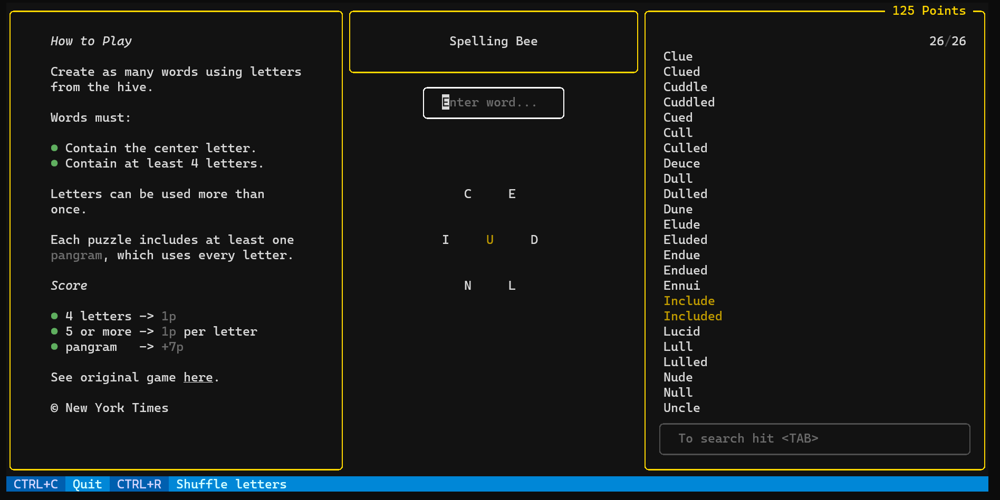

# 🐝Spelling Bee🐝
My TUI clone of the *New York Time's Spelling Bee*.



© New York Times. See original game [here](https://www.nytimes.com/puzzles/spelling-bee).

# Install
To play you must first install dependencies by running:
```sh
make install
```

# How to Play
Simply enter the following command:
```sh
./app.py play codtiem
```
* The first letter must be the central one.
* The order of the rest of the letters does not matter.
* You can use lowercase and uppercase letters.
* Your past answers will be saved automatically.

To reset the game and delete all past answers, enter:
```sh
./app.py play codtiem --new-game  # or -n
```

To show past saves and their score:
```bash
./app.py list
```
